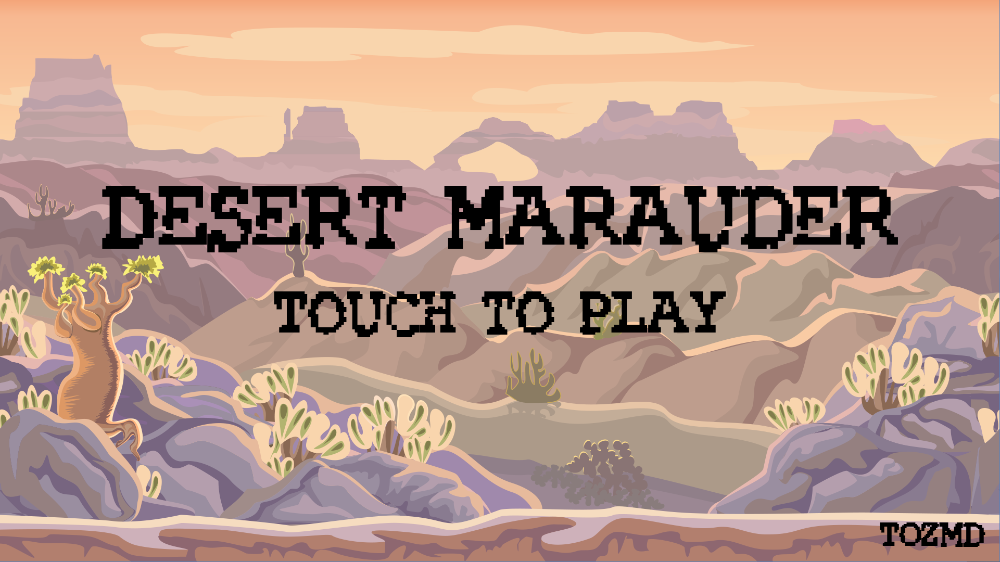
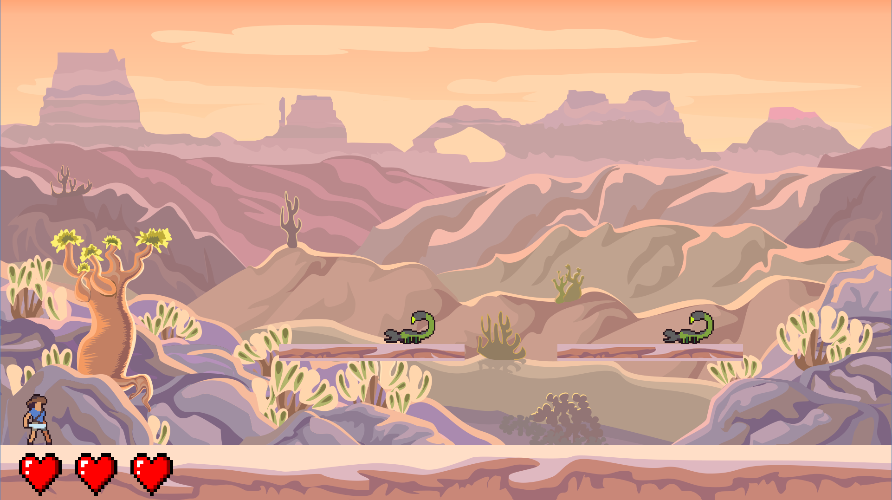
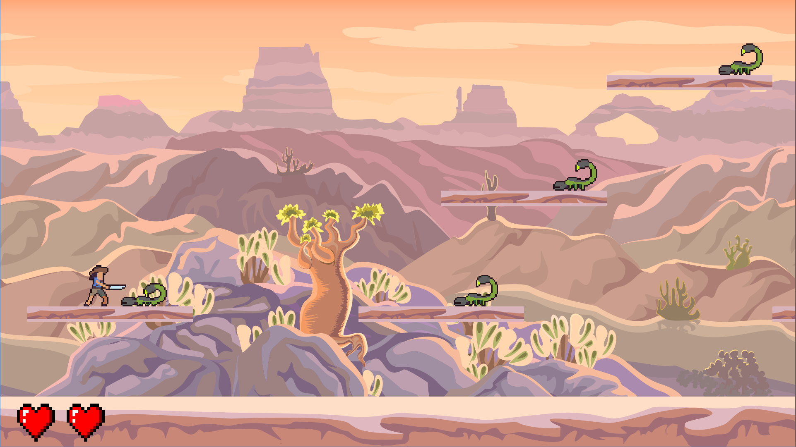
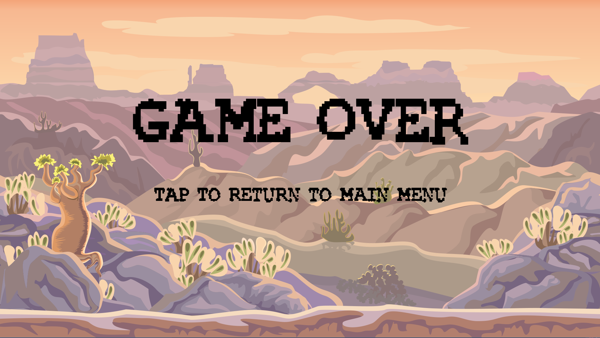

# Desert Maruader

    
    
    
    

## Asset License
Assets are modified or original copies provided by CraftPix.net. The license can be viewed [here.](https://craftpix.net/file-licenses/)

## Downloads
Releases can be found on the [release page](https://github.com/tozmd/DesertMarauder/releases). It's a runnable .jar, so a JRE is required.
